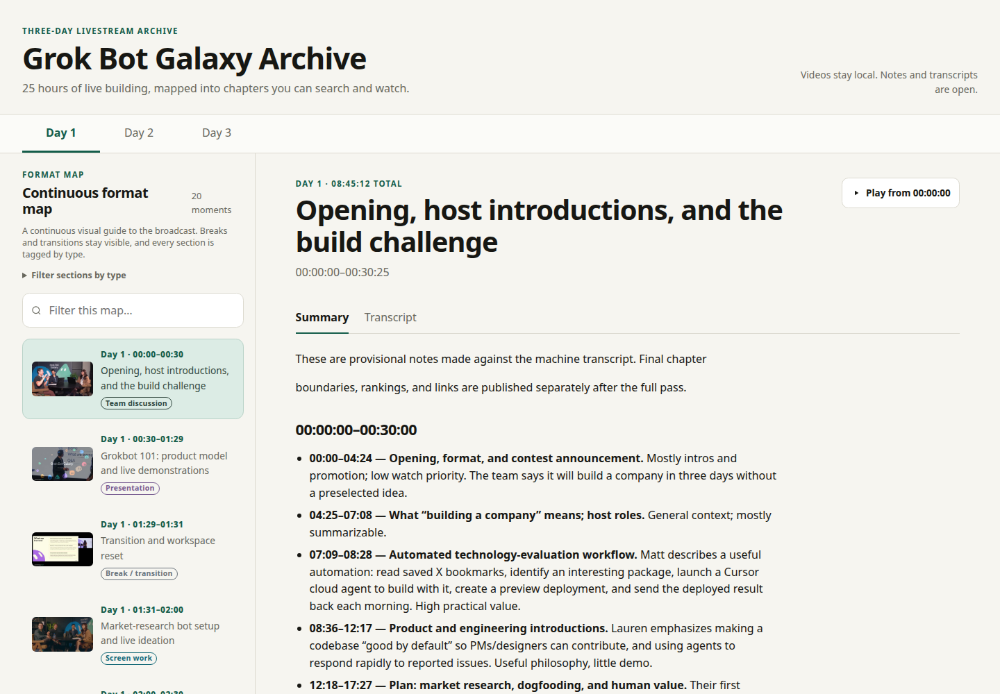
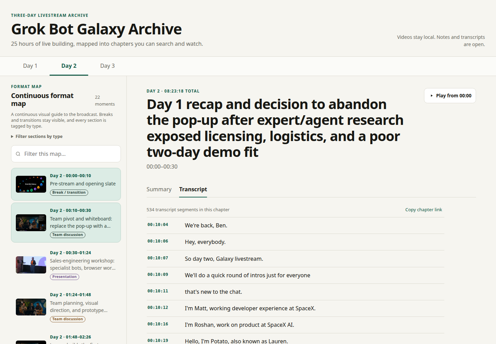

# Grok Bot Galaxy Livestream Archive

Search and explore all **25 hours, 6 minutes** of xAI's three-day
[Grok Bot Galaxy](https://x.ai/galaxy) livestream without scrubbing through the
full recordings. This independent archive turns Days 1–3 into ranked highlights,
timestamped chapter summaries, complete searchable transcripts, subtitles, and
a local video viewer that jumps to the exact moment.

At Grok Bot Galaxy, the xAI team used Grok Bot across a live company build,
alongside role-specific demos and workshops. This repository preserves the
practical engineering, agent-orchestration, debugging, reliability, sales, and
marketing lessons in a form you can browse in minutes.

- **Find the useful parts:** 50 scored chapters plus ranked viewing guides.
- **Navigate the broadcast by format:** continuous maps for all three days, with thumbnails and tags for presentations, screen work, team discussion, and breaks.
- **Search every word:** Markdown, plain text, SRT, VTT, and raw JSONL.
- **Jump straight to evidence:** chapter and transcript timestamps seek local video.
- **Reproduce the archive:** yt-dlp download and resumable Faster-Whisper pipeline.

The recordings stay local and are never committed.

## Inside the archive

The viewer now opens on a **continuous format map** for the selected day. Each
section is shown with a thumbnail and a format tag—presentation, screen work,
team discussion, or break/transition—so you can choose what to watch before
opening its notes or transcript.

[](docs/screenshots/chapter-summary.png)

*Start with a continuous format map: every visible section has a thumbnail and a type tag.*

[](docs/screenshots/timestamped-transcript.png)

*Move from the Day 2 map into the matching transcript slice and jump to the exact moment.*

## Run the searchable viewer

Start the static viewer from the repository root:

```bash
make run
```

Open <http://localhost:8000/docs/>. Choose a day, then select a tagged section
from its format map; the detail pane opens its summary and matching transcript
slice. Expand **Filter sections by type** to switch to presentations, screen
work, team discussions, or the original fixed-window timeline. Timestamp links
load the local video at the exact matching second when it is present under
`videos/`. The included server supports byte ranges, so seeking does not require
downloading a multi-gigabyte file from the beginning.

Use `make run PORT=8080` to choose a different port.

| Broadcast | Duration | Guide | Transcript |
|---|---:|---|---|
| Day 1 — Grok Bot Galaxy Livestream | 08:45:12 | [Guide](content/day-1/README.md) | [Markdown](content/day-1/transcript.md) · [SRT](content/day-1/transcript.srt) |
| Day 2 — Grok Bot builds a Game Studio LIVE | 08:23:18 | [Guide](content/day-2/README.md) | [Markdown](content/day-2/transcript.md) · [SRT](content/day-2/transcript.srt) |
| Day 3 — Building a company in 3 days | 07:58:22 | [Guide](content/day-3/README.md) | [Markdown](content/day-3/transcript.md) · [SRT](content/day-3/transcript.srt) |

The rankings favor live coding, debugging, architecture, verification, and
practical agent-management techniques. They distinguish observed behavior from
claims and call out security, reliability, and evaluation caveats.

## Repository layout

```text
content/
  day-1/                 guide, transcript formats, and chapter notes
  day-2/
  day-3/
docs/                    dependency-free digest viewer (GitHub Pages-ready)
scripts/
  download_broadcast.sh  resumable yt-dlp wrapper
  transcribe.py          checkpointed Faster-Whisper transcription
  render_transcript.py   Markdown/TXT/SRT/VTT renderer
  sync_viewer_data.sh    refreshes the viewer from content/
  serve.py               local server with seekable video byte ranges
videos/                   local media; ignored by Git
broadcasts.json           source URLs, filenames, durations, and IDs
```

## Reproduce the pipeline

The full walkthrough is in [docs/WORKFLOW.md](docs/WORKFLOW.md). In short:

```bash
# Download a public X broadcast into the ignored videos/ directory
scripts/download_broadcast.sh \
  "https://x.com/i/broadcasts/BROADCAST_ID" replay-1200

# Set up local transcription
python3 -m venv .venv
.venv/bin/python -m pip install -r requirements.txt

# Resume-safe transcription in 30-minute chunks
.venv/bin/python scripts/transcribe.py \
  "videos/Your broadcast [BROADCAST_ID].mp4" \
  --output content/day-N/transcript.raw.jsonl \
  --model small.en --chunk-minutes 30 --threads 8 --beam-size 5

# Generate readable and subtitle formats
.venv/bin/python scripts/render_transcript.py \
  content/day-N/transcript.raw.jsonl \
  --title "Day N — Broadcast title" \
  --video "../../videos/Your broadcast [BROADCAST_ID].mp4" \
  --output-prefix content/day-N/transcript

# Refresh static viewer copies after content changes
scripts/sync_viewer_data.sh
```

The download command is based on the actual recovered workflow used here:
`yt-dlp` with continuation, concurrent HLS fragments, explicit format selection
when needed, ffmpeg MP4 merging, and broadcast IDs in filenames.

## Transcript formats

Each day contains:

- `transcript.md` — readable transcript with clickable timestamps;
- `transcript.txt` — compact timestamped text for search;
- `transcript.srt` and `transcript.vtt` — subtitles;
- `transcript.raw.jsonl` — resumable checkpoints and confidence metadata; and
- `chapters/*.md` — scored sections, takeaways, caveats, and narratives.

The transcripts were generated locally with Faster-Whisper `small.en`. They are
complete but not human-edited. Common errors include “SpaceX AI” for “xAI” and
“RockBot/Grokbat” for “Grok Bot”. Verify exact quotations against the recording.

## Publishing and rights

`.gitignore` excludes `videos/*`, partial downloads, model caches, the virtual
environment, and working artifacts. Run `git status` before publishing and
confirm that no media, cookies, tokens, or credentials are staged.

Project-authored code, guides, summaries, and annotations use the MIT license.
Broadcast recordings and transcript material may carry third-party rights; read
[NOTICE.md](NOTICE.md) before publishing a fork.
